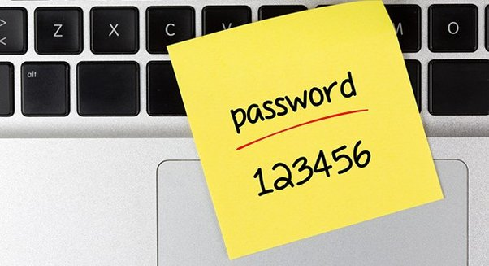

Almost on every reputed website password isn’t stored in plain-text. It is hashed *(*[*Cryptographic hash function - Wikipedia*](https://en.wikipedia.org/wiki/Cryptographic_hash_function)*)* and salted. If you store passwords in plain-text then any intruder can just get hold of 'em.



A cryptographic hash function is, you can say, a mathematical algorithm (hence a function) to convert an arbitrary input (aka message) to a string (bit array, to be precise) of a fixed size, which is called a hash/digest. These are designed to be one-way functions, i.e., you can't get the message from the hash. The only way is to brute-force (which could take millions of years for a strong password), or use rainbow tables (which contains precomputed data). Going deep into this subject is out of scope of this answer, as it requests explanation in simple terms.

Salt is a random string which is concatenated or added in the password for extra security, which is then hashed. In this way, the password is more secure as the hash of real password is different from the hash of salted password. For example,

Password = upvote_this_answer_NOW

Salt = shklf87et6ehbg

Salted password = upvote_this_answer_NOWshklf87et6ehbg

```
Salted password’s hash = e10be86c2fc46dcf669d49f5f29e1dd7b1bf4e135f07cb4541e106ee0a591db6d5823187b1e88154775f2a9c1e3926eb88ee68f1d9bbedd372324185118c4a10
Real password’s hash = fecf3e2c732cce39f056937cba78bbd4797b091865deb2eae88ef645cc167d353cf3d24163430268ba18c110e68c4b218eb369f341d82c334c673b464601443e
```

Clearly, the hashes[^sha512] are different. (Future 2023 addendum: So the hacker doesn't have to cringe at the shameless string, oh god I was stupid in 2017.)

[^sha512]: Used SHA512.

Now, here's what happens behind the scene when you enter a password:

-   You enter the password.
-   It is then salted.
-   The password is then hashed using the cryptographic hash functions in use.
-   The hash is compared to the stored hash. If it matches, the password is correct.

Contains excerpts from [my answer to How does one create a strong password? Any tips?](/posts/2017/07/06/how-does-one-create-a-strong-password-any-tips).

Thanks for reading!

