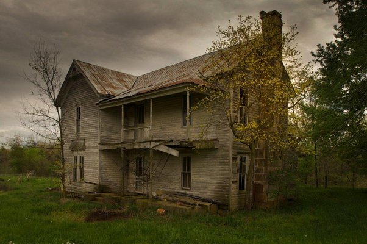

Essentially, without any pseudo-childish-hacking fuss, it *simply* goes like this:

-   DDoS attack is like a mob attack on a shop or a riot. When that happens, the shop is shut down and curfew maybe imposed on the area.
    -   DDoS is a coordinated attack on a web server, overflowing it with huge amounts of requests and traffic that the poor server's resources are forced to become unavailable.

-   Darknet is just like an area of abandoned houses. You can ring their doorbells but you won't get an answer back. You aren't supposed to be there in the first place.
    -   A darknet is a portion of routed, allocated IP space not running any services. Traffic arriving to such IP dark space is undesired since it has no active hosts. ([Darknet - Wikipedia](https://en.m.wikipedia.org/wiki/Darknet) )

-   Dark web are websites which cannot be indexed by search engines and can only be accessed using special software. (Note that search engines can't index your inbox, but you don't need a special software to access your inbox. Your inbox is also referred as "deep web".) Softwares and systems providing access to darknet cloak your identity by changing your names many times.
    -   Dark web's overlay network route your connection through several proxies so that your identity is anonymous. These websites can't be indexed by search engines and requires specially configured software to access them.

Don't go by others on internet. This isn't complicated, as you can see the similarity between points and sub points above.

One thing - *Dark web isn't dangerous in itself.* Communicating and interacting with random strangers over the internet is.

*Ignore online fanatic fantasies.* And you're good to go.
