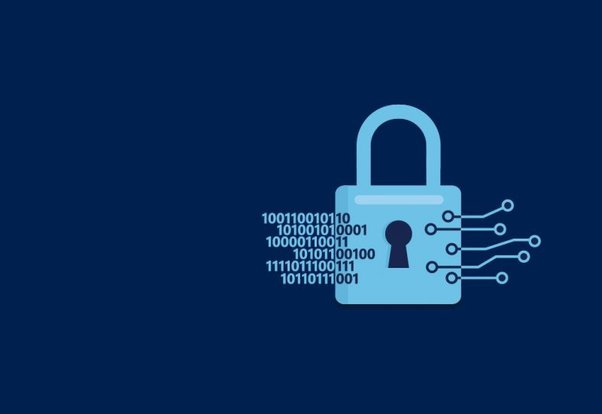
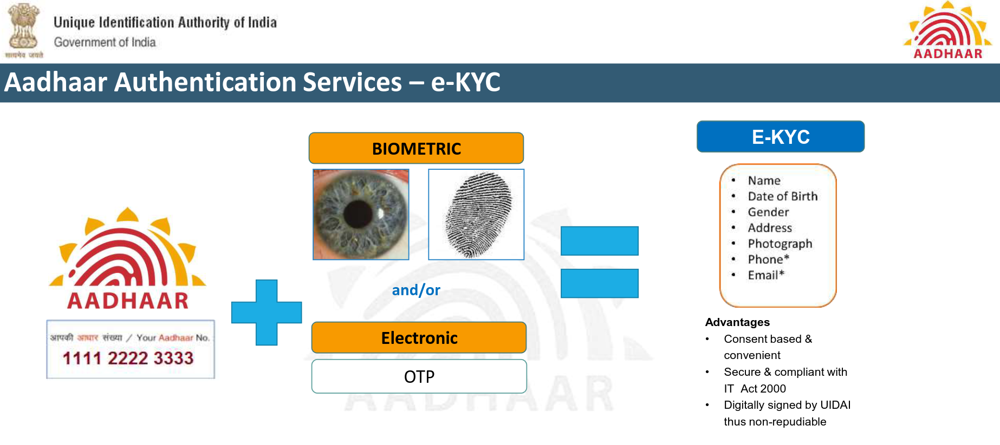
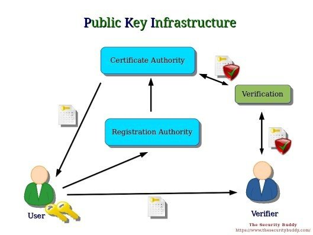
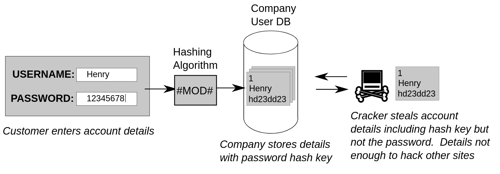

*Warning! Not your average bitching answer.*

Well, let's do a quick recap of what Aadhaar, an authentication system, does.

1.  The end-user/application supplies some data to the system, like Aadhaar number, name, age, DOB, etc. which is to be authenticated.
2.  The Aadhaar system compares this with its own record, and would like to verify with OTP and biometrics that the authentication request is indeed by the guy whose data is being processed.
3.  If the comparison and verification is successful, the system would tell back that the information supplied is correct according to its record and hence, authenticated, and *sometimes sends back the information in database.*
4.  The user/application sees this and does whatever it wants to do by getting the confirmation.

---

*Isn't this working sorta* *like…… password?*

With the exception of sending back data, it is working exactly how a password works.

So… maybe we can get rid of the exception?!

*Source: Introduction to Aadhaar, TRAI.[^aadhaar-trai]*

[^aadhaar-trai]: https://trai.gov.in/sites/default/files/presentations_&_cv/Day-3_25Aug2017/Session2_Digital%20world/Digital%20Identifiers_Ashok%20Kumar.pdf

***Aadhaar is primarily an authentication system.*** It is not concerned and doesn't care two shits about what the end-user does with the information. A bank may use it for your account or government for DBT. All the system cares about is the integrity of information provided.

As far as I know, and I would be happy to be corrected, Aadhaar uses PKI+AES and sprinkle of other cryptographic functions to store the database as it is intact, with names and addresses available if requested by the system.

But Aadhaar is an authentication system. It should **not** be concerned about giving back any data. A yes/no reply by the system, as the same system does when verifying biometric[^ekdrishti], should ideally be the case.

[^ekdrishti]: [Understanding Aadhaar: Data Security — ekdrishti (archived)](https://web.archive.org/web/20191217193438/https://ekdrishti.in/understanding-aadhaar-data-security-85d361d47f72)

***Thus, we can make it to work and store the data just like password!***

(If you don't know how password works, my[ answer to In simple language, how do passwords work? How does an application reject the wrong password?](/posts/2017/12/24/in-simple-language-how-do-passwords-work-how-does-an-application-reject-the-wrong-password/) would be a good introduction to it, along with terms like salting, hashing.)

---

Thus, Aadhaar data in database can be ideally treated as *accounts,* identified by the Aadhaar number or the virtual ID.

***The details tied to the Aadhaar number can be salted and hashed, just like a password for, say, your Quora account.***

*Source: Pluke, CC0, via Wikimedia Commons.[^wikimedia-hash]*

[^wikimedia-hash]: https://commons.wikimedia.org/wiki/File:CPT-Hashing-Password-Hashed.svg

So when there's an authentication request, the information supplied by the **user** would be salted and hashed, and *then* compared to the stored hashes! The verification (OTP, biometric stuff) can be done by the system as it did earlier. This improves the security, and it also has the potential to eliminate raw data transmission over the network entirely.

This way, integrity of data could be verified, and data leaks can be minimised because *hashes are one-way cryptographic functions.[^crypto-hash] Once you have a hash, you can't have the thing which you hashed back from the hash,* unless you brute-force (which would take trillions of years) or precomputed data in rainbow tables.[^rainbow-table]

The 2n/2 bound[^birthday-attack] for avoiding collision can easily be taken care of by, say, SHA512. The population of India (or the world) is unlikely to be anywhere near even 0.00000000000000000000000000000000000000000000000000000000000001% of 2256 .

[^crypto-hash]: [Cryptographic hash function - Wikipedia](https://en.wikipedia.org/wiki/Cryptographic_hash_function)
[^rainbow-table]: [Rainbow table - Wikipedia](https://en.wikipedia.org/wiki/Rainbow_table)
[^birthday-attack]: [Birthday attack - Wikipedia](https://en.wikipedia.org/wiki/Birthday_attack)

There's one thing to this, even the Government would be unable to access the raw data from UIDAI Aadhaar database when they would need to. But do they even need to? :)

---

Thanks for reading!

~ \<Named Quora profile link signoff>
