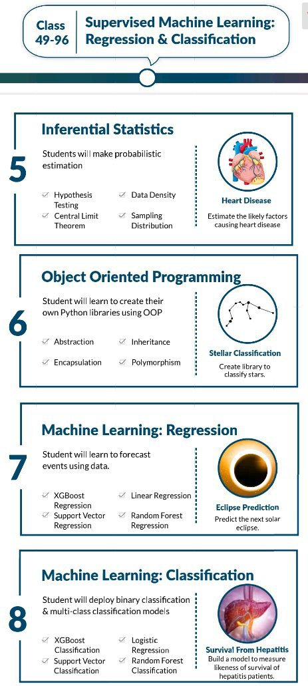

This post is a part of migration of my content from Quora. This answer quickly amassed 1k+ upvotes (not common for a no-name user like me) and a lot of interesting comments, in probably less than a week. After that, it was shadow-collapsed by Quora (for no mentioned reason, indicating potential mass reporting), and I didn't even know that for quite a *lot* of months. An email appeal to reinstate the answer was successful, but it was too late at that point.

---

**TL;DR: WhiteHatJr fools people with buzzwords and mines & profiles every shred of their kids' (and probably parents' too) data.**

I will use [Wayback Machine](http://web.archive.org) links for references so as to save the snapshot incase they change the website.

I will also use mobile screenshots instead of a desktop so as to make them more readable for mobile users.

Let's start with a cursory look at their homepage.[^homepage]

[^homepage]: https://web.archive.org/web/20201001194135/https://www.whitehatjr.com/


>   1:1 online coding classes.

Does that mean every child gets personal attention? The teacher's seemingly stock photo there makes me think they want that to imply.

>   *Last 19 Spots Left

We all know this strategy, needs no introduction. Also, it seems like their coders, or the program they coded doesn't know the rules of grammar.


Lots of buzzwords sprinkled here and there. Silicon valley, Google, Waymo, and what not. I doubt a kid who doesn't know what is 23² would be able to handle the heavy data and statistics used in machine learning at Waymo offices.

Also, more than 3 lakh reviews by students. Earlier they said there was 1:1 teaching. Did they handle more than 3 lakh personal 1:1 education sessions (since students can review each class and educator)? Lmfao.

Okay you might say let's cut some slack since the company is fairly recent. So we can assume they have atleast 10% the number of educators. 30k teachers, is it? Apparently, they have 7k teachers. If every educator made the kid capable for a job involving stuff with driverless cars, they are either very supreme beings who decided to stay underground for years and then suddenly come together to work for this company, or the claim is fake.

The homepage consists of more buzzwords (including a claim about 1 million+ students (1M == 10L) being associated. Adds a cherry to the 1:1 claim) and extolling about their teachers. One particular thing I would like to point out is their age and price requirements:


Huh a class 1 student who generally doesn't know trigonometry will code for space missions. Just for a nominal price of ₹1L. I guess all our schools and colleges are soon going to be obsolete. **Finally!** Thanks, whitehatjr! /s

---

Before proceeding, let us take a quick look at the *detailed curriculum* of their ₹99,999 (or I should say ₹1,07,999) plan for grade 1.[^syllabus_class_1]

[^syllabus_class_1]: https://web.archive.org/web/20201001200711/https://cdnwhjr.s3.ap-south-1.amazonaws.com/website/curriculumpdf/12-mar-2020/details/BEG.pdf

*They don't even use the Indian numbering system, so much for educating India's kids.*


Woah! So advanced syllabus!

Jokes and sarcasm aside, I don't even need to go into that “syllabus” to point out it's total scam in the name of “AI/ML” (like almost always). Most of it seems like drag and drop stuff branded like AI/ML.

Let's cut some slack considering its class 1, let's look at class 10+ curriculum.[^syllabus_class_10]

[^syllabus_class_10]: https://web.archive.org/web/20201001201804/https://cdnwhjr.s3.ap-south-1.amazonaws.com/website/curriculumpdf/12-mar-2020/details/APT.pdf


BRUH MOMENT. You are paying ONE LAKH RUPEES for this, which is just school education. Why do I say this? Here's why:


*Hmm cool, let's look at the juicy things I'm gonna learn for building the next Google! Aatmanirbhar Bharat, here I come!*


1.  For teaching AI/ML to you, they will first teach you what are variables, if else conditionals, loops, and functions.
2.  Then they will teach you graphs and Pandas “dataframes” and numpy “arrays”. Without any knowledge of what's happening and how their data is actually fed or manipulated!
3.  **AFTER** teaching you numpy and cooldude hackerman data science stuff, they will teach you the basic building blocks, viz., strings, list, tuples, and dictionaries!
4.  Then you'll study some basic statistics taught in class 12. Remember, after graphs, plots, Panda dataframes, and numpy!

So much bluffing. Similar goes for the tasks on the right.



Some more class 12 statistics and CS stuff. The major bluff here is about “XGBoost”. The arxiv print[^xgboost_arxiv] (submitted on 2016) has the following abstract:

[^xgboost_arxiv]: https://arxiv.org/abs/1603.02754

>   Tree boosting is a highly effective and widely used machine learning method. In this paper, we describe a scalable end-to-end tree boosting system called XGBoost, which is used widely by data scientists to achieve state-of-the-art results on many machine learning challenges. We propose a novel sparsity-aware algorithm for sparse data and weighted quantile sketch for approximate tree learning. More importantly, we provide insights on cache access patterns, data compression and sharding to build a scalable tree boosting system. By combining these insights, XGBoost scales beyond billions of examples using far fewer resources than existing systems.

And the paper consists of stuff like this:


or


This is not the stuff a 14 year old learns (unless your kid is some math genius like Terence Tao, at that point you would know it's futile to waste money here). Even yours truly does not know it and hence is unable to explain it to you.

Finally let's look at the third part. You'd expect some more advanced and juicy stuff.


Oh, so we are back to statistics marketed with buzzwords and captivating tasks. We also see a mention about absolute basic things like matrices and covariance, taught in class 12 and college courses which are not on AI or ML. Whitehatjr doesn't fail to disappoint you more, isn't it?

---

Before proceeding to the last part, I chanced upon a blog post of theirs. This absolutely shreds any credibility they may have in your mind, if you know stuff about programming.[^best_prog_lang] A prior knowledge about programming helps here.

[^best_prog_lang]: https://web.archive.org/web/20201001210711/https://blog.whitehatjr.com/coding-for-kids/the-best-kids-coding-languages/


Oh,

```diff
>programming language of HTML
>best use of PHP is interactive pages with WordPress and Drupal
>PHP is LITTLE difficult for “small” kids
>it is EASY to learn for more mature kids
```


So according to them Lua is the best introductory language, and Lua code is upon Roblox's default (?) boilerplate (they didn't even use the correct word and terminologies lmao).


Well, it turns out learning PHP and Lua was just scratch. Now the actual beast, Python, has entered into the game! Wow! Also, there is a very kid friendly reference, [Python.org](http://python.org), quoted there!


```diff
>So the reason Java is popular is because of Minecraft.
>Minecraft has its own name among programming languages.
>Inb4 Java == Minecraft
>Minecraft as a learning tool for Java.
>Tfw you realise Minecraft is closed source.
```

---

Now, let's see their privacy policy.[^privacy_policy] I'll just quote it here and add emphasis, since a screenshot would be too impractical.

[^privacy_policy]: https://web.archive.org/web/20201001214127/https://code.whitehatjr.com/privacy-policy

>   -   We collect information that may be used to identify you or your Child (“Personal Information”) including, but not limited to, (i) name, e-mail ID, photograph, location and other contact information (ii) gender and other demographics (iii) birth date and year of the Child to validate their age.
>   -   We also collect certain information either when you provide it using the Platform or Services and/or automatically as you or the Child navigate through the Platform (which may include usage details, IP address, device ID and type, your browser type and language, the operating system used by the device, access times, and information collected through cookies, web beacons and other tracking technologies). You agree that we may use such information to do internal research on our Users' demographics to better understand, protect and serve our Users.

So they collect all PII of the child, and track the child. But this is nothing, see the next part:

>   -   We collect information from your user ID associated with any social media account (such as your Facebook and Google account) that users use to sign into the Platform or connect with or use of our Services. When you sign in with your social media account information, or otherwise connect to your social media account with the Platform, **you consent to our collection, storage, and use, in accordance with this Privacy Policy, of the information that you make available to us through the social media interface. This includes, without limitation, any information that you have made public through your social media account, information that the social media service shares with us or information that is disclosed during the sign-up and sign-in processes.**

So any social media you link to them, they have the rights to store and mine every single shred of information on that profile which is public, plus the information you give them access to while signing in.

Basically, you are allowing them to collect every data available on your social media sites.

>   -   If any of the Users allows us to collect information from his or her device phonebook—and you or the Child’s are one of that User’s contacts—we may combine the information we collect from that User’s phonebook with other information we have collected about you. We may also obtain information from other sources and combine that with the information we collect through the Platform.

So they are correlating your profile and information with others, which includes using phonebook and mobile numbers.

***So basically, you're giving them a free pass to profile your children from their digital infancy.*** And they make it absolutely clear later:

>   -   You agree that we may use Personal Information about you to improve our marketing and promotional efforts, to analyse site usage, improve the Platform's content and Service offerings, and customize the Platform's content, layout, and Services. These uses improve the Platform and better tailor it to meet your needs, so as to provide you with an efficient, safe and customized experience while using the Platform.

---

So whitehatjr is basically

-   Bluffing around both at the homepage and at the curriculum.
-   Got technicalities about programming itself wrong. So much for teaching programming.
-   Meanwhile they capture every bit (pun intended) of information about you and your child to profile you and use it for more targetted advertisement and more tracking. Essentially monetising it while your child is profiled since day 1.
-   Your child gets nothing to learn and you lose money on sketchy claims.

---

Thanks for reading!

~ \<Named link to my profile\>

---

EDIT 1 (4/10/2020):

Here are some videos which will demonstrate the superior quality of education at whitehatjr!

[https://youtu.be/qbtMCRRSsuc](https://www.quora.com/_/redirect?sig=979eda&url=https://youtu.be/qbtMCRRSsuc)

[https://youtu.be/E09n3BkrI_I](https://www.quora.com/_/redirect?sig=834e24&url=https://youtu.be/E09n3BkrI_I)

Both have been archived in case they get taken down.[^video_1] [^video_2]

[^video_1]: https://web.archive.org/web/20201004065219/https://www.youtube.com/watch?v%3DqbtMCRRSsuc%26feature%3Dyoutu.be
[^video_2]:https://web.archive.org/web/20201004065406/https://www.youtube.com/watch?v%3DE09n3BkrI_I%26feature%3Dyoutu.be

