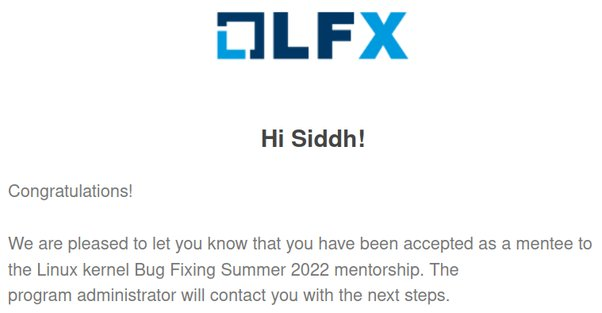
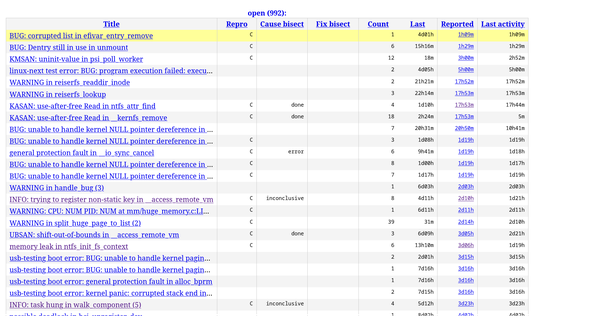

A fine 45°C May afternoon, with no one to disturb in a room with ceiling fan at full speed and a window AC, was the perfect opportunity for me to study for my upcoming offline end-semester examinations with books on the table at the window. Of course, after studying for quite some time, a break is needed, and I probably took a short break of just 3 hours.

While goofing off on the internet, I came across the **Linux Kernel Mentorship Program** (LKMP), which is described[^lkmp] as:

[^lkmp]: https://wiki.linuxfoundation.org/lkmp

>   The Linux Kernel Mentorship Program offers a structured remote learning opportunity to aspiring Linux Kernel developers. Experienced Linux Kernel developers and maintainers mentor volunteer mentees and help them become contributors to the Linux Kernel.

Being a long time Linux user, this seemed like a good opportunity to work on something which I use everyday, coupled with my affinity towards low-level side of things which I wanted to explore and work on. So I decided to at least take a look at the registration process, as the looming threat of an academic massacre[^ap_exam] in the June exam was preventing me from freely thinking about applying.

[^ap_exam]: 92% of class failed in a mid-sem after colleges re-opened, truly an online student moment. Though, it arguably was the hardest semester, with some of the hardest yet very interesting core subjects.

The first thing to do was to register on the LFX platform[^lfx], which was not exclusive to LKMP and had a multitude of mentorship programs (touching various fields) being hosted there. After making a profile on the platform by filling suspiciously[^registration] detailed fields, and searching for what I was looking for, I came across **Linux Kernel Bug Fixing Summer 2022**[^lkmp_s2022], which had this noticeably big button:

[^lfx]:https://mentorship.lfx.linuxfoundation.org/
[^registration]: The details are probably used for application to the programs, as evident by the one-click application I experienced.
[^lkmp_s2022]: https://mentorship.lfx.linuxfoundation.org/project/8bdac7b8-403f-489d-8999-ed16bca09cd2


I thought "*let's see how the confirmation page looks like*", and I aimlessly clicked it…

And it immediately enrolled me. Nothing asked — it just directly led me to the screening tasks.


---

Now that I was into it by my own choice, there is no going back. The screening tasks needed to be completed in a week or so, as the applications were closing on the 18th (*maybe I should have goofed off more often*).

The screening tasks themselves were a good opportunity to learn things, doing which I learnt about the basics of kernel development. Completing the LFD103[^lfd103] course was also a task, and almost all the other tasks were actually related to what I learnt from the online course. I compiled the Linux kernel for the first time on my own machine and booted into it natively, a small step in the journey, *yet a very significant one*. After some experimenting, I quickly realised I can't keep rebooting every time I make changes to the kernel (also secure boot needs to be turned off), so I came across QEMU and KVM, which is very convenient.

[^lfd103]: https://trainingportal.linuxfoundation.org/learn/course/a-beginners-guide-to-linux-kernel-development-lfd103/course-introduction/course-information

QEMU[^qemu] is a virtualiser and emulator, which can emulate many different CPU architecture and topologies. Using hypervisors, it can emulate the instructions of the virtual machines directly, which yields a performance close to your hardware. If you know about Oracle's VirtualBox, you can think QEMU as a faster, better, more configurable, more extensive version of it. QEMU literally pwns VirtualBox. You can run a virtual machine with full-blown OS with the userspace UI and everything, or you can just boot into a minimal configuration using the terminal, which is exactly what you want for kernel development.

[^qemu]: https://www.qemu.org



Towards the end of May, I got selected as a mentee[^prog_duration] in the program along with 12 others. The mentors were Shuah Khan, an experienced kernel developer, maintainer, and contributor; and Pavel Skripkin, who is also experienced with the kernel and its internals. Shuah maintains Kernel Selftest (`kselftest`), USB over IP, and `cpupower` tools, and is a veteran. Pavel has also contributed to other kernel related projects like smatch and syzkaller.

[^prog_duration]: For the period of June start to August end.

---

I was free to choose any bug I wanted to work upon. But before that, some specific prerequisite knowledge needs to be there, and thus there were initial tasks around learning kernel event tracing[^event_tracing], dynamic program analysis, fuzzing, etc.

[^event_tracing]: https://www.kernel.org/doc/html/latest/trace/events.html

It is useful to know, during runtime, what is happening and executing, which route did the kernel take, what events are triggered, etc. Thus, tracing the events is a good way to debug bugs, as one can see what is happening when the bug gets triggered. Many different event tracers are available, and `function_graph` is particularly helpful as it shows the call stack in a structured way, showing which kernel *functions* are executed, along with any context switches which happen. A small sample is:

```
 1) ! 611.961 us  |  hci_uart_tty_open();
 1)               |  hci_uart_tty_ioctl() {
 1)               |    hci_alloc_dev_priv() {
 1)   2.832 us    |      hci_cmd_sync_init();
 1)   8.267 us    |      hci_request_setup();
 1) + 15.134 us   |      hci_init_sysfs();
 1) ! 164.203 us  |    }
 1)               |    hci_register_dev() {
 0)               |  hci_uart_tty_open() {
```

Analysis is needed for detecting bugs. Bugs are of a serious concern as they introduce unintended consequences, like program crash, security issues, reducing the quality of code/program, etc. Hunting bugs at a later stage tends to be more costly as some other person has to have a good look at everything again.

Thus, we should try to find and squash bugs as much as possible before releasing the program to the users. Analysis of program help us in doing that. Broadly, there are two ways employed for analysing the behaviour of programs:

1.   **Static analysis**, wherein we analyse the program's code (usually source code, but one can do analysis of machine code too) and look out for bugs. For instance, a hard-coded out-of-bound bug can be detected using static analysis. The analysis is thus consequently done on properties which will hold for all executions of the program.
2.   **Dynamic analysis**, wherein we analyse the program's execution when it is running. For instance, we may have an out-of-bound bug due to dynamic access. That can be easily detected using dynamic analysis compared to static analysis. The analysis is thus consequently done on properties which holds just for that single run of program.

The analysis of bugs and their subsequent reporting can be classified into two types:

1.   **True positive**: The bug report is correct, i.e., the behaviour is indeed a bug.
2.   **False positive**: The bug report is incorrect, i.e., the behaviour is not a bug and is intended. These are the *type-1 errors* in statistical parlance. (Thus, *type-2 errors* are just the undetected bugs.)

From basic statistical and/or practical engineering knowledge, we can infer there must be a trade-off, especially in static analysis, between increasing the number of true positive reports and reducing the number of false positive reports.

With dynamic analysis, we catch unintended behaviour (like use-after-free or out-of-bound access) at runtime, and hence we are *typically* getting no (i.e., zero) false positives. The trade-off comes into play with the fact that these bugs must be triggered during execution in order to detect them. Untriggered bugs are not detected, and thus code coverage is an important metric.

It has consequently been observed that:

-   Static analysis may report comparatively more true positives, but they will also report a number of false positives.
-   Dynamic analysis may report comparatively lesser true positives, but will report less false positives.

Analysis can be run in user-space or in kernel-space. Linux kernel allows us to run debugging in kernel-space. Compilers like `clang` and `gcc`, and tools like `coccinelle`[^coccinelle] allow for the static analysis of the codebase. Tools like `KASAN`[^kasan], syzkaller[^syzkaller-gh], etc. help in dynamic analysis of the kernel at runtime.

[^coccinelle]: https://www.kernel.org/doc/html/latest/dev-tools/coccinelle.html
[^kasan]: https://www.kernel.org/doc/html/latest/dev-tools/kasan.html
[^syzkaller-gh]: https://github.com/google/syzkaller

Also, there is the superiorest technique of adding print (`pr_info`) statements, though they should be added judiciously as sometimes they may interfere in the racing if one is examining race conditions.

---

In addition to off-the-record conversations with mentors and the mentee peer group, there were also bi-weekly Zoom meetings with Shuah and Pavel, which were very helpful, and helped in learning a lot and solving some doubts. Having a peer group or/and someone to guide is valuable, whoever they may be, since it steers/motivates us in the right direction.

Linux kernel development happens over email (you can see archives online[^lore]), and not something like GitHub or GitLab[^dri-gl]. One might think it is because the kernel predates these services (which is true) but should now "upgrade" to newer technologies. But one must keep in mind the sheer volume and size of the kernel: thousands of contributors are there, the kernel has more than 1.1 lakh commits, and all of this must be accessible with least friction. Email is a ubiquitous protocol, and not a locked-in service by some specific company, and thus it provides the least barrier to jump into sending patches (Signing up to see? What's that?). The alternatives doesn't scale for the sheer size of kernel contributions, and mostly can't be accessed offline. Email also helps in decentralization like git.

[^lore]: https://lore.kernel.org/
[^dri-gl]: Current email ecosystem also comes with its own problems (like patch series/conversation management), so subsystems like DRI are moving towards self-hosted GitLab instances (since GitLab has an open-sourced version unlike GitHub).

---

The syzkaller dashboard[^syzkaller-web] is the place (along with the `syzkaller-bugs` mailing list) where we can find bugs reported by syzbot after fuzzing the Linux kernel. If you want to find bugs to fix, this currently should be your go-to-place to find some.

[^syzkaller-web]: https://syzkaller.appspot.com/upstream



Syzbot reports bugs and provides the kernel config and a reproducer which triggered the bug, so you can reproduce the bug locally on your machine. It also provides helpful patch testing facility by email, which you can use to verify if your fix works for the bot too.

I had looked at and touched a number of subsystems during the course of my mentorship. The internals of Linux kernel was explored in the process. Of course, initially it was overwhelming (since I had never done this), but over time I learnt how to go about looking at the right places. As the debugging skills improved, I gained more confidence into fixing a bug and eventually sent patches upstream, fixing bugs reported by syzbot and static analysers.

I fixed bugs related to things like race conditions (use-after-free and null-pointer dereference), logical problems causing warnings to be triggered, things pointed out by static analysis tools and docs.

As of 26th August, I have 6 patches accepted, some are waiting for review, and some have been rejected. I have also contributed to the stable kernel (i.e. patch gets backported to the "stable" LTS kernel). The code review on mailing list is direct and to-the-point, and people are very helpful and don't differentiate whether you are a beginner or not.

You can search for me in kernel git on https://git.kernel.org/pub/scm/linux/kernel/git/next/linux-next.git/log/?qt=grep&q=Siddh+Raman+Pant, and can find my mailing list activity on https://lore.kernel.org/all/?q=Siddh+Raman+Pant.

Three months ago, I never imagined I would be able to do this. It has been a very good learning experience! That one aimlessly curious mouse click resulted in a rabbit hole.

---

The point[^flex] of this post is to encourage the reader to contribute to the Linux kernel.

[^flex]: Also written because I want to put this out somewhere while it is fresh on my mind.

We use the kernel everyday, in various forms you might even be unaware of, and the kernel comes for free, as in free lunch, so why not contribute back upstream, whatever the little we can? I'm certainly not telling to sell your soul for this, even just observing the working helps. This is the sort of thing where you can learn a lot of interdisciplinary things whatever your field be, and your work *will* actually have an impact!

**When you will update and use Linux, code I have contributed will also run on *your* computer and devices!**

Isn't that cool™? If it is, what are you waiting for?

---

I am migrating select content from my Quora account to this blog. This post is part of the same migration, with some minimal changes done. Also, this same post was also posted by me on LinkedIn.

I also spoke about my mentorship on LFXMS 2023. Slides can be downloaded from https://siddh.me/from_clueless_to_confident.pdf. Let me know your thoughts in the comment section below!
