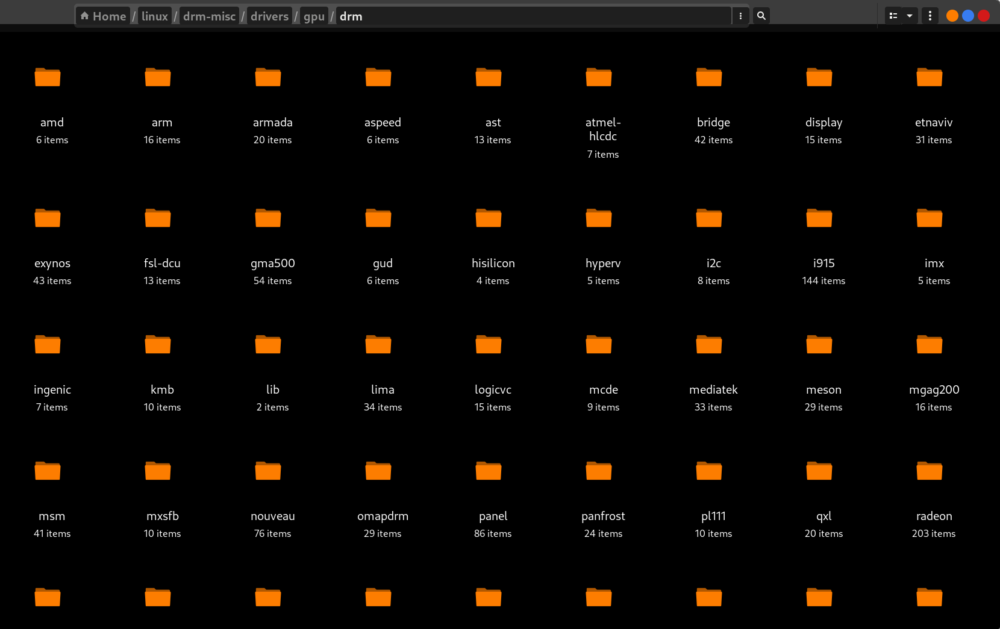
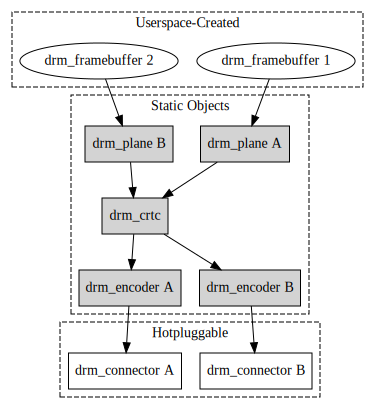
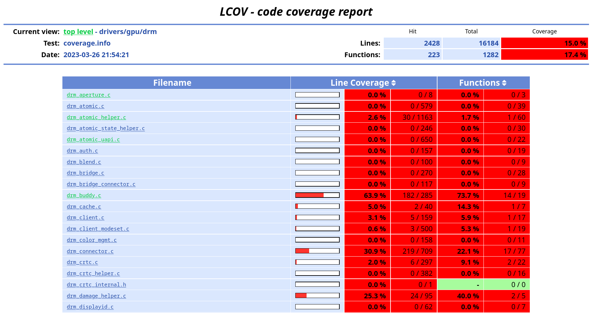

## About DRM subsystem

Direct Rendering Manager is very central from the point of view of usability — it is ***the*** subsystem responsible for showing what is on our screen, including this post. As such, it is directly responsible for enabling the wide adoption of Linux distros, and is what the user is visibly impacted by.

The DRM subsystem is populated largely by display drivers mainly maintained by the companies who make GPUs. The `drivers/gpu/drm` directory consisting of various drivers for various vendors and devices can be seen on nautilus as below:

Thus, in order to incorporate drivers for different hardware in the kernel, we can't have driver authors churn out duplicate code for the same thing, and want a standardised hardware-independent interface to make lives easier and to have the codebase maintainable. This is fulfilled by the core of the DRM subsystem ("DRM core" henceforth) — the drivers are then left to manage the hardware-specific nitty-gritties and features.

---

## DRM core basics - what and why

The DRM subsystem is responsible for the management of GPUs from kernelspace and interfacing them with userspace. It handles all the hardware resources, and allows for multiple programs to use the hardware unlike a giant superuser application providing an indirect interfacing (X server). DRM handles memory management, interrupt handlers, switching between GPUs (like between dGPU and iGPU), mode-setting, and rendering composition of frames.

A **mode** is a set of display properties like resolution, color depth, refresh rate, etc. A part of the DRM subsystem known as Kernel Mode Setting (KMS) is responsible for setting the mode and rendering frames on the screen. <u>The working can be boiled down to the following:</u>

The pixels to render are stored as frames in GPU's memory buffers known as **framebuffers**. DRM provides an abstraction to manage these framebuffers. A framebuffer is managed using a "**plane**", which handles cropping and scaling of the frames (so that we have scrolling and zooming).

A screen may have multiple elements, and we might need to overlay frames on top of other frames (instead of redrawing everything). A good example is the mouse pointer. Thus, we need composition, as well as generate the data to send to the monitor for rendering. This is handled in hardware by **scanout buffers**. In DRM lingo, they are (unfortunately in my opinion) known as **CRTC** — from CRT (Cathode Ray Tube) Controller. It is *not* related to controlling the magnetic fields in a typical CRT setup. This misleading term is a holdover from the old days when monitors were on CRT technology.

The DRM CRTC abstraction allows for blending / composition of several planes, and outputs the frame which needs to be rendered on the screen. A chunk of modesetting is done in this part — from screen resolution to refresh rate. This is hence a **central part** of DRM subsystem, as this is responsible for *what* is finally shown on the screen.

The scanout signals generated by CRTC then needs to travel to the screen over the PHY (the physical interface / wire connecting the GPU to screen). But the PHY's interface (the "**connector**" such as VGA, HDMI, etc.) may require the signal in a certain format. Thus, we need to encode the output from the CRTC before giving it to the connector. This is handled by the appropriately named "**encoder**". This also allows for abstraction of the PHY — CRTC code does not need to worry about the *where* and *how* the signal will travel.

Schematically, the KMS display pipeline can be shown as follows (courtesy [kernel docs](https://dri.freedesktop.org/docs/drm/gpu/drm-kms.html#overview)):

Originally, this needed several different commands to the kernel. This implies going through several different states (the states increase combinatorically with the number of commands). If we try to do an invalid setting, we will come to know of its invalidation only at the point the actual invalid command is sent. This can be after a chunk of setup being done already and rolling back may be impossible. This also yeilds visible "tearing" — the next frame may not have been rendered properly as refresh rate / VBLANK (time between rendering the last visible line of a frame and the first visible line of the next frame) synchronisation is not guaranteed. Composite frames may render layer-by-layer instead of together (i.e, no "perfect" frame).

"Atomic mode-setting" allows for giving a configuration and having it verified by the driver. If the configuration requested by the program is invalid, the driver lets it know and does not do any changes. Only if the configuration is valid does the driver do any hardware operations. It also allows for perfect frame — allows for queuing multiple configurations and renders them together at the next VBLANK clock cycle.

According to [Theirry Redding at FOSDEM 2015](https://archive.fosdem.org/2015/schedule/event/kms_atomic/), the interface parameters of stuff like CRTC, planes, etc. are converted to properties of an object. The whole state of hardware is thus encapsulated in atomic state objects. Whenever we want to modify something, we modify the properties of these atomic state objects instead of issuing the command to the hardware directly.

This way, we can pile up several modifications into one object, and issue the final resultant modification to the hardware. Also, after modification the atomic object is checked whether its configuration is valid or not. If it is valid, only then the configuration is applied to the hardware at the next VBLANK clock cycle. Thus, drivers also don't need to worry about synchronisation.

---

## Need for tests

Naturally, the DRM subsystem (like any other kernel subsystem) is huge. While the code is written and maintained by trustable and qualified kernel developers, such a huge codebase can benefit from hard statistics about its reliability by means of tests, as well as the architectural and behavioural documentation provided by having tests.

DRM core is, as discussed, a crucial piece of infrastructure, and thus one would expect it to be reliably tested given the importance of enforcing standardisation upon competitive and fragmented market forces. Unfortunately, the core is largely untested, as can be seen in the following coverage report obtained using KUnit:

It is a general consensus in the community that this needs to change, and thus more tests need to be written. Due to the nature of DRM susbsystem, and kernel code in general, unit testing is a good way to go, and already has good support by way of KUnit, which I introduce in the next post.
